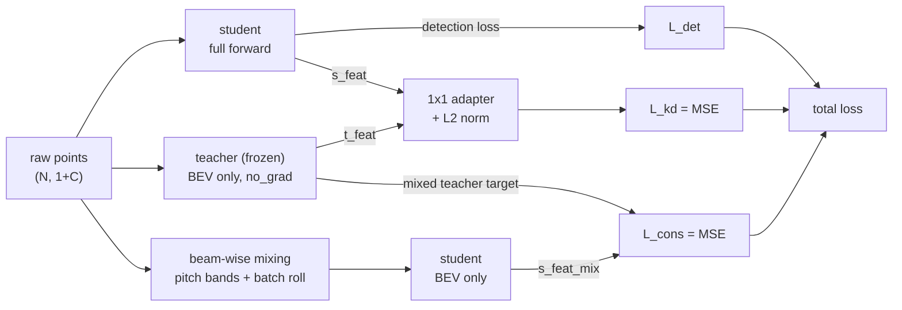

# BWM-Distill-PointPillars

**Beam-Wise Mixing Consistency for BEV Feature Distillation in LiDAR-Based 3D Object Detection**

Transferring a CenterPoint-pillar encoder into an anchor-based PointPillars
detector on nuScenes, regularized by a beam-wise point-cloud mixing consistency
constraint. Both constraints are training-time only — inference cost is
unchanged.

[](LICENSE)
[](https://github.com/open-mmlab/OpenPCDet)
[](https://www.nuscenes.org/)

Zikang Zhou · Xiamen University · 2026

---

## Abstract

LiDAR-based 3D object detectors trade accuracy against latency. Pillar-based
detectors such as PointPillars are fast enough for on-vehicle deployment but
lag substantially behind center-based detectors such as CenterPoint. This work
asks whether the perceptual capability of the stronger detector can be pushed
into the weights of the cheaper one **without changing the student architecture
or its inference cost**.

Two training-time-only constraints are combined:

1. **BEV feature distillation (KD).** A frozen CenterPoint-pillar teacher
   supplies a bird's-eye-view feature map; the student is trained to match it
   through a 1x1 adapter under an L2-normalized MSE.
2. **Beam-Wise Mixing (BWM) consistency.** LiDAR points are partitioned into
   pitch (elevation) bands and swapped between two scenes in a batch. The
   student's BEV response to the *mixed* cloud must equal the correspondingly
   *mixed* teacher response. This is a consistency regularizer in the spirit of
   LaserMix (Kong et al., 2023), applied as a teacher-target constraint rather
   than as semi-supervised mixed-sample training.

Neither constraint survives into inference: the deployed model is a stock
PointPillars network with the same FLOPs and the same latency as the baseline.

On nuScenes, the combination lifts the student from **34.61 → 40.70 mAP**
(+17.6% relative) and **49.51 → 54.68 NDS** (+10.4% relative), recovering
**39.5% of the mAP gap** and **46.2% of the NDS gap** to the teacher, at zero
inference cost and no measurable increase in training wall-clock time.

---

## Method

### Training pipeline

Each training step performs three forward passes; only the first carries the
detection loss.



```
L = L_det  +  w_kd * ramp * L_kd  +  w_cons * ramp * L_cons
```

| Pass | Input | Network | Output | Gradient |
| --- | --- | --- | --- | --- |
| 1 | raw points | student, full | detection loss + `s_feat` | yes |
| 2 | raw points | teacher, up to `spatial_features_2d` | `t_feat` | no (`no_grad`, frozen, `eval`) |
| 3 | mixed points | student, up to `spatial_features_2d` | `s_feat_mix` | yes |

The teacher stops at `spatial_features_2d`; its dense head, target assignment
and NMS never run, so the side branch never needs `gt_boxes`.

### Beam-Wise Mixing

Per-point elevation is `theta = atan2(z, sqrt(x^2 + y^2))`. On a spinning LiDAR
each laser sits at a fixed theta, so binning theta groups **beams** — hence
*beam-wise*.

1. Sample `K` in `{3,4,5,6}` pitch bands over `[-30deg, +10deg]` (the HDL-32E
   vertical FOV of nuScenes), with a random phase offset of up to half a band,
   so the boundaries never land on the same laser rings twice.
2. Draw a cyclic shift `perm` over the batch — this guarantees `perm[b] != b`
   and has the closed-form inverse used to relabel points.
3. Sample `b` keeps its **even** bands and receives the **odd** bands of its
   partner `perm[b]`. Total point count is conserved.
4. Build a BEV mask `M` in `[0,1]^(B x 1 x H x W)` recording, per cell, the
   fraction of points supplied by the sample itself. Cells that no point lands
   in fall back to an analytic flat-ground ring model
   (`r = ground_z / tan(theta)` — equal pitch bands project onto concentric
   **annuli**, not Cartesian stripes).
5. Consistency target: `M * t_feat + (1 - M) * t_feat[perm]`.

**Why the mixing must straddle the network.** Mixing the *features* of two
completed forward passes with the same mask is provably a no-op: `M` and
`1 - M` have disjoint support, the cross terms vanish, the batch roll cancels
under the sum, and the loss collapses exactly onto `L_kd` — a constant
multiplier on `KD_LOSS_WEIGHT` and nothing more. The student forward must sit
*between* the two halves of the mixing operator for the constraint to carry any
information at all. The mixed branch also deliberately produces **no** detection
loss: ground-truth boxes straddling band boundaries are not re-cut, so BWM is a
feature-level regularizer, not mixed-sample supervised training.

---

## Results

nuScenes validation set. All three student arms use an **identical** student
network, data pipeline and optimizer; they differ only in `MODEL.NAME` and the
loss blocks (see [Experimental protocol](#experimental-protocol)). The teacher
row is the released `cbgs_pp_centerpoint_nds6070` CenterPoint-pillar checkpoint.
Raw numbers: [`docs/results/nuscenes_val_metrics.csv`](docs/results/nuscenes_val_metrics.csv).

| Metric | Exp 1 — Baseline | Exp 2 — +KD | Exp 3 — +KD +BWM | Teacher (CenterPoint) |
| :--- | ---: | ---: | ---: | ---: |
| **mAP** ↑ | 0.3461 | 0.3994 | **0.4070** | 0.5003 |
| **NDS** ↑ | 0.4951 | 0.5391 | **0.5468** | 0.6071 |
| mATE (translation) ↓ | 0.3843 | 0.3721 | **0.3670** | 0.3113 |
| mASE (scale) ↓ | 0.2695 | 0.2663 | **0.2625** | 0.2604 |
| mAOE (orientation) ↓ | 0.4295 | 0.4257 | **0.3884** | 0.4288 |
| mAVE (velocity) ↓ | 0.4947 | **0.3444** | 0.3504 | 0.2389 |
| mAAE (attribute) ↓ | 0.2009 | **0.1973** | 0.1987 | 0.1914 |

### Contribution of each constraint

| Metric | KD alone (Exp1→Exp2) | BWM adds (Exp2→Exp3) | Total (Exp1→Exp3) | Teacher gap recovered |
| :--- | ---: | ---: | ---: | ---: |
| mAP ↑ | **+0.0533** | +0.0076 | +0.0609 (+17.6%) | 39.5% |
| NDS ↑ | **+0.0440** | +0.0077 | +0.0517 (+10.4%) | 46.2% |
| mATE ↓ | −0.0122 | −0.0051 | −0.0173 (−4.5%) | 23.7% |
| mASE ↓ | −0.0032 | −0.0038 | −0.0070 (−2.6%) | 76.9% |
| mAOE ↓ | −0.0038 | **−0.0373** | −0.0411 (−9.6%) | — <sup>†</sup> |
| mAVE ↓ | **−0.1503** | +0.0060 | −0.1443 (−29.2%) | 56.4% |
| mAAE ↓ | −0.0036 | +0.0014 | −0.0022 (−1.1%) | 23.2% |

<sup>†</sup> Gap recovery is undefined for mAOE: the teacher (0.4288) is
essentially level with the baseline (0.4295), so there is no teacher advantage
to recover. Exp 3 **surpasses the teacher** on this metric by 0.0404.

### Findings

**1. The two constraints improve disjoint capabilities.** This is the central
result. Distillation and BWM are not two ways of buying the same accuracy —
they act on different error modes:

- **KD transfers velocity estimation.** mAVE falls by 30.4% from KD alone
  (0.4947 → 0.3444) and barely moves thereafter. CenterPoint's center-based
  head makes velocity regression structurally easier, and that advantage is
  exactly what crosses the KD channel.
- **BWM transfers orientation robustness.** mAOE is flat under KD (−0.0038,
  within noise) and then drops sharply once BWM is enabled (−0.0373). Since the
  teacher holds *no* orientation advantage over the baseline, this gain cannot
  have come from the teacher's knowledge. It is produced by the regularizer
  itself: forcing the student to respond consistently when whole laser bands
  are exchanged between scenes internalizes an orientation-aware invariance,
  consistent with the mechanism reported for LaserMix (Kong et al., 2023).

**2. Headline gains are dominated by KD, with BWM adding a consistent positive
margin.** Of the +0.0609 mAP, KD contributes +0.0533 and BWM +0.0076; of the
+0.0517 NDS, +0.0440 and +0.0077 respectively. BWM's contribution to mAP/NDS is
small but positive on both, and it improves four of the five error metrics.

**3. A per-metric trade, not a uniform lift.** BWM slightly *worsens* mAVE
(+0.0060) and mAAE (+0.0014), both within the run-to-run band and both far
smaller than the mAOE gain it buys. Reported here rather than smoothed away.

**4. The student cannot close the gap, and the reason is architectural.** Exp 3
recovers roughly 40–46% of the teacher's mAP/NDS advantage and stalls there.
The residual is attributable to the detection head — an anchor-based
`AnchorHeadMulti` against a center-based `CenterHead` — and to the limited
epoch budget, neither of which distilling encoder features can overcome. The
persistent mATE (+0.0557) and mAVE (+0.1115) deficits against the teacher are
precisely the metrics where the center-based head is structurally superior.

**5. The gains are free at inference and effectively free in training.** Both
constraints are training-time only; the deployed model is architecturally
identical to the Exp 1 baseline. Measured wall-clock training time was ~10
hours for each of the three runs on the same rented GPU (>30 hours total), with
the differences inside the fluctuation caused by GPU thermal and memory
conditions.

**Conclusion.** Feature distillation plus beam-wise mixing consistency raises a
stock PointPillars detector by +6.09 mAP / +5.17 NDS on nuScenes at zero
inference cost. The two constraints are complementary rather than redundant:
distillation imports the teacher's velocity perception, while beam-wise mixing
produces an orientation robustness the teacher itself does not possess.

### Pretrained weights

Trained checkpoints for the experiments above are released here:

**https://drive.google.com/drive/folders/1EB3W9-JAxQtWEb7H3HVTq44JakdIRht_**

Download a checkpoint and evaluate it directly with the matching config — see
[Evaluate](#5-evaluate).

---

## Experimental protocol

The value of a three-arm ablation depends entirely on the arms differing in one
variable. This repository enforces that:

| | Student | Teacher | KD | BWM | Epochs |
| :--- | :--- | :--- | :---: | :---: | :---: |
| **Exp 1** | DynPillar PointPillars | — | — | — | 20 |
| **Exp 2** | DynPillar PointPillars | dyn-pp CenterPoint | ✓ | — | 20 |
| **Exp 3** | DynPillar PointPillars | dyn-pp CenterPoint | ✓ | ✓ | 20 |

The three YAML files are **key-for-key identical** outside `MODEL.NAME` and the
distillation / BWM blocks. That claim is checkable mechanically rather than by
inspection:

```bash
python scripts/verify_configs.py
```

Two confounds present in the initial setup were removed:

1. **The baseline used a different student.** The stock `pointpillar.yaml` uses
   `PillarVFE` + `transform_points_to_voxels` with `NUM_FILTERS: [64]`, whereas
   the distillation configs use `DynPillarVFE` +
   `transform_points_to_voxels_placeholder` with `NUM_FILTERS: [64, 64]`. The
   Exp1→Exp2 delta therefore mixed *"distillation helps"* with *"dynamic
   pillars help"*. The baseline has been moved onto the dynamic-pillar student
   so all three arms share one encoder. If the classic static-pillar number is
   wanted, report it separately as Exp 0 — **do not** use it as the control for
   Exp 2 / Exp 3.
2. **Unequal epoch budgets.** `NUM_EPOCHS` is fixed at 20 in all three files.

Exp 3 is implemented as `ConsistencyDistillPP(DistillPointPillar)` overriding
only `get_extra_loss()`. The KD path is *the same code object*, not a copy, so
any Exp2/Exp3 delta is attributable to the consistency term alone.

---

## Repository layout

The tree mirrors OpenPCDet's, so the files drop straight into a checkout.

```
BWM-Distill-PointPillars/
├── pcdet/models/detectors/
│   ├── distill_pointpillar.py                    # Exp 2 — KD detector, base class for Exp 3
│   └── consistency_distill_pointpillar.py        # Exp 3 — adds the BWM consistency term
├── tools/cfgs/nuscenes_models/
│   ├── pointpillar.yaml                          # Exp 1 — baseline
│   ├── distill_pointpillar.yaml                  # Exp 2
│   └── consistency_distill_pointpillar.yaml      # Exp 3
├── scripts/
│   └── verify_configs.py                         # proves the arms differ in one variable
├── docs/
│   └── results/nuscenes_val_metrics.csv          # the results table, machine-readable
├── CITATION.cff
├── LICENSE
└── README.md
```

---

## Getting started

### 1. Environment

Install [OpenPCDet](https://github.com/open-mmlab/OpenPCDet) following its
official instructions. This repository adds files to that tree; it is not a
standalone package.

### 2. Install the detectors and configs

This repository mirrors OpenPCDet's directory layout, so installation is a copy
plus two registration lines. Copy the five files into the corresponding paths of
your checkout, then append the following to
`pcdet/models/detectors/__init__.py` — **import order matters here, because
Exp 3 subclasses Exp 2**:

```python
from .distill_pointpillar import DistillPointPillar
from .consistency_distill_pointpillar import ConsistencyDistillPP

__all__['DistillPointPillar'] = DistillPointPillar
__all__['ConsistencyDistillPP'] = ConsistencyDistillPP
```

### 3. Data

Prepare nuScenes `v1.0-trainval` per the OpenPCDet guide:

```bash
python -m pcdet.datasets.nuscenes.nuscenes_dataset --func create_nuscenes_infos --cfg_file tools/cfgs/dataset_configs/nuscenes_dataset.yaml --version v1.0-trainval
```

### 4. Train

Exp 1 — baseline:

```bash
python train.py --cfg_file cfgs/nuscenes_models/pointpillar.yaml --batch_size 4 --epochs 20
```

Exp 2 — feature distillation:

```bash
python train.py --cfg_file cfgs/nuscenes_models/distill_pointpillar.yaml --batch_size 4 --epochs 20
```

Exp 3 — distillation + beam-wise mixing consistency:

```bash
python train.py --cfg_file cfgs/nuscenes_models/consistency_distill_pointpillar.yaml --batch_size 4 --epochs 20
```

### 5. Evaluate

```bash
python test.py --cfg_file cfgs/nuscenes_models/consistency_distill_pointpillar.yaml --batch_size 4 --ckpt ../output/nuscenes_models/consistency_distill_pointpillar/default/ckpt/checkpoint_epoch_20.pth
```

To reproduce the reported numbers without training, point `--ckpt` at a
released checkpoint instead — see [Pretrained weights](#pretrained-weights).

---

## Configuration reference

### Distillation (Exp 2 and Exp 3)

| Key | Default | Meaning |
| :--- | :--- | :--- |
| `TEACHER_CFG_FILE` | `cfgs/nuscenes_models/cbgs_dyn_pp_centerpoint.yaml` | Teacher config; must share the student's `POINT_CLOUD_RANGE` / `VOXEL_SIZE`. |
| `TEACHER_CKPT` | — | Frozen teacher weights. |
| `NORMALIZE_FEATURES` | `True` | L2-normalize both feature maps along the channel dim before the MSE. |
| `KD_LOSS_WEIGHT` | `1.0` | Weight on the KD term. Not comparable to pre-normalization values. |
| `WARMUP_STEPS` | `500` | Linear ramp on the distillation terms, in iterations (~7000 iter/epoch at batch 4). |

### Beam-Wise Mixing (Exp 3 only)

| Key | Default | Meaning |
| :--- | :--- | :--- |
| `CONS_WEIGHT` | `1.0` | Weight on the consistency term. |
| `BWM.ENABLED` | `True` | Master switch. Also inactive when `batch_size < 2`. |
| `BWM.NUM_AREAS` | `[3, 4, 5, 6]` | Band-count pool, resampled every iteration. |
| `BWM.PITCH_RANGE_DEG` | `[-30.0, 10.0]` | Sensor vertical FOV. **The most likely way to make BWM a no-op is to get this wrong.** |
| `BWM.BAND_MODE` | `uniform` | `uniform` = equal width in theta (as LaserMix); `quantile` = equal point count per band. |
| `BWM.GROUND_Z` | `-1.8` | LiDAR height above ground, negative. Only used to fill empty BEV cells. |
| `BWM.MASK_MODE` | `raster` | `raster` = mask built from where the mixed points actually landed; `analytic` = pure flat-ground rings. |
| `BWM.SOFT_MASK` | `True` | Keep fractional mask values at band boundaries instead of a hard 0/1 edge. |

### Training diagnostics

Three TensorBoard scalars should be checked before trusting a run:

| Scalar | Expected | If violated |
| :--- | :--- | :--- |
| `bwm_partner_ratio` | ~0.5 | Bands are unbalanced and little real mixing occurs; `cons_loss` converges onto `kd_loss` and **Exp 3 silently degenerates into Exp 2**. Switch `BAND_MODE` to `quantile`. |
| `bwm_mask_mean` | **not** 0.5 | Expected to be skewed — under uniform pitch bands the far field collapses into one band, so BEV *area* is unbalanced even when the point split is not. ~0.63 measured on synthetic data. |
| `kd_loss` / `rpn_loss` | 0.1 – 0.3 | If KD dominates, lower `KD_LOSS_WEIGHT` — do not raise the other terms. |

### Cost

Forward passes per step are 1 / 2 / 3 for Exp 1 / 2 / 3; measured step time
scales roughly 1 : 1.6 : 2.3. Under memory pressure `BATCH_SIZE_PER_GPU` may
drop to 2 (BWM requires at least 2), but it must drop in **all three** configs —
batch size changes both BN statistics and the LR schedule.

---

## Implementation notes

Five points separate this implementation from a naive one; the first two are
silent-correctness issues rather than tuning choices.

1. **The teacher gets its own dict.** Reusing the shared `batch_dict` lets the
   teacher forward overwrite `pillar_features`, `voxel_coords` and
   `spatial_features_2d` in place, after which everything read from it is
   silently the teacher's tensors.
2. **The teacher stops at `spatial_features_2d`** — no dense head, no target
   assignment, no NMS.
3. **A 1x1 conv adapter** (Conv-BN-ReLU) precedes the student features, built
   in `__init__` rather than lazily: OpenPCDet constructs the optimizer before
   the first forward, so a lazily created layer would never receive gradients.
4. **L2 normalization before the MSE**, so the loss weight expresses a
   trade-off instead of fighting the raw activation scale. This shifts the loss
   magnitude by orders of magnitude — weights tuned without normalization do
   not carry over.
5. **The teacher is excluded from checkpoints** and pinned to `eval()` through
   an overridden `train()`, so the outer `model.train()` cannot flip its BN
   layers back into training mode.

---

## Limitations and validity

Stated plainly, because they bound what the results support:

- **The teacher is not a stronger architecture, only a better-trained
  encoder.** `cbgs_dyn_pp_centerpoint` shares the student's VFE, MAP_TO_BEV and
  BACKBONE_2D line for line; it differs only in the head (`CenterHead` vs
  `AnchorHeadMulti`). What transfers here is a better-trained encoder, not a
  more powerful backbone. This does not weaken the experiment, but it must be
  described accurately.
- **"Beam-wise" is approximate on nuScenes.** The 10-sweep aggregation
  motion-compensates past sweeps into the current frame, so their theta is no
  longer exactly the original laser angle. The partition stays geometrically
  sensible; it is not a clean per-beam split.
- **The flat-ground ring model is a fallback only.** Points on tall structures
  break the `r = ground_z / tan(theta)` relation — a car roof and the road at
  equal radius have noticeably different pitch — which is why the mask is
  rasterized from actual point locations, with the analytic rings filling only
  the empty cells.
- **The teacher coupling carries assumptions.** The teacher shares the
  student's dataset object, which is valid only when their `POINT_CLOUD_RANGE`
  and `VOXEL_SIZE` agree; a mismatch raises a warning at build time, so watch
  the logs. Swapping in a voxel-based teacher such as
  `cbgs_voxel01_res3d_centerpoint` breaks this in two places: the teacher would
  need GPU re-voxelization at its own resolution, and a dataset proxy reporting
  its own `grid_size` so the sparse backbone is built at the right spatial
  shape.
- **Unit-level verification** covers point-count conservation across mixing,
  the absence of fixed points in `perm`, mask shape and value ranges, both band
  modes, and the subclass MRO — all on synthetic point clouds.
- **Single-seed results.** No variance estimate across seeds; metric
  differences below ~0.005 should not be read as significant.

## Open work

- `CONS_WEIGHT: 0.0` — isolates the cost of the third forward pass alone.
- `BWM.MASK_MODE: analytic` — quantifies whether rasterization pays for itself.
- `BWM.NUM_AREAS: [4]` — removes the band-count randomness.
- `BWM.BAND_MODE: quantile` — corrects an unbalanced `bwm_partner_ratio`.
- Multi-seed runs, for variance estimates on the sub-0.005 deltas.
- A center-based student head, to test whether the residual mATE/mAVE gap is
  indeed head-architectural.

---

## Citation

```bibtex
@mastersthesis{zhou2026beamwise,
  author  = {Zhou, Zikang},
  title   = {Beam-Wise Mixing Consistency for BEV Feature Distillation
             in LiDAR-Based 3D Object Detection},
  school  = {Xiamen University},
  type    = {Bachelor's Thesis},
  year    = {2026}
}
```

Machine-readable metadata is in [`CITATION.cff`](CITATION.cff).

## Acknowledgements

- The [OpenPCDet](https://github.com/open-mmlab/OpenPCDet) toolbox
  (OpenPCDet Development Team, 2020), on which this implementation is built.
- [AutoDL](https://www.autodl.com/) for cost-effective GPU rental.

## References

- Lang, A. H., Vora, S., Caesar, H., Zhou, L., Yang, J., & Beijbom, O. (2019).
  *PointPillars: Fast Encoders for Object Detection from Point Clouds.* CVPR.
- Yin, T., Zhou, X., & Krahenbuhl, P. (2021).
  *Center-based 3D Object Detection and Tracking.* CVPR.
- Kong, L., Ren, J., Pan, L., & Liu, Z. (2023).
  *LaserMix for Semi-Supervised LiDAR Semantic Segmentation.* CVPR.
- Liu, Z., Tang, H., Amini, A., Yang, X., Mao, H., Rus, D., & Han, S. (2023).
  *BEVFusion: Multi-Task Multi-Sensor Fusion with Unified Bird's-Eye View
  Representation.* ICRA, 2774–2781.
- Caesar, H., et al. (2020). *nuScenes: A Multimodal Dataset for Autonomous
  Driving.* CVPR.
- OpenPCDet Development Team. (2020). *OpenPCDet: An Open-source Toolbox for
  3D Object Detection from Point Clouds.*

## License

Released under the [MIT License](LICENSE). OpenPCDet and the nuScenes dataset
carry their own licenses, which apply to their respective components.
